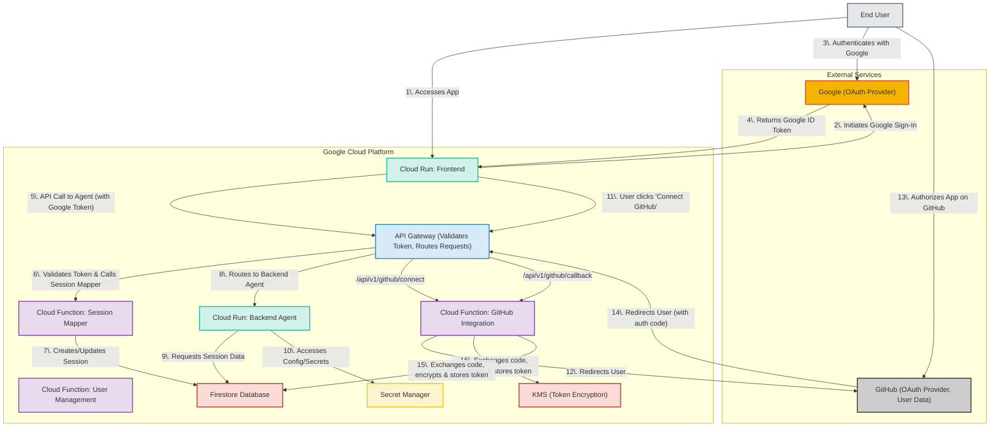

```mermaid
graph TD
    subgraph "External Services"
        Google["Google (OAuth Provider)"]
        GitHub["GitHub (OAuth Provider, User Data)"]
    end

    subgraph "Google Cloud Platform"
        API_Gateway["API Gateway (Validates Token, Routes Requests)"]
        Cloud_Run_Frontend[Cloud Run: Frontend]
        Cloud_Run_Backend[Cloud Run: Backend Agent]
        Cloud_Function_UserMgmt[Cloud Function: User Management]
        Cloud_Function_GitHub[Cloud Function: GitHub Integration]
        Cloud_Function_SessionMapper[Cloud Function: Session Mapper]
        Firestore[Firestore Database]
        Secret_Manager[Secret Manager]
        KMS["KMS (Token Encryption)"]
    end

    User[End User]

    %% Primary Authentication Flow (Google OAuth)
    User -- 1\. Accesses App --> Cloud_Run_Frontend
    Cloud_Run_Frontend -- 2\. Initiates Google Sign-In --> Google
    User -- 3\. Authenticates with Google --> Google
    Google -- 4\. Returns Google ID Token --> Cloud_Run_Frontend

    %% Agent Interaction Flow (Requires Authentication)
    Cloud_Run_Frontend -- 5\. API Call to Agent (with Google Token) --> API_Gateway
    API_Gateway -- 6\. Validates Token & Calls Session Mapper --> Cloud_Function_SessionMapper
    Cloud_Function_SessionMapper -- 7\. Creates/Updates Session --> Firestore
    API_Gateway -- 8\. Routes to Backend Agent --> Cloud_Run_Backend
    Cloud_Run_Backend -- 9\. Requests Session Data --> Firestore
    Cloud_Run_Backend -- 10\. Accesses Config/Secrets --> Secret_Manager

    %% Secondary Flow: Connecting GitHub Account (User is already logged in)
    Cloud_Run_Frontend -- 11\. User clicks 'Connect GitHub' --> API_Gateway
    API_Gateway -- /api/v1/github/connect --> Cloud_Function_GitHub
    Cloud_Function_GitHub -- 12\. Redirects User --> GitHub
    User -- 13\. Authorizes App on GitHub --> GitHub
    GitHub -- 14\. Redirects User (with auth code) --> API_Gateway
    API_Gateway -- /api/v1/github/callback --> Cloud_Function_GitHub
    Cloud_Function_GitHub -- 15\. Exchanges code, encrypts & stores token --> KMS & Firestore

    %% Component Styles
    style API_Gateway fill:#D6EAF8,stroke:#2E86C1,stroke-width:2px
    style Cloud_Run_Frontend fill:#D1F2EB,stroke:#1ABC9C,stroke-width:2px
    style Cloud_Run_Backend fill:#D1F2EB,stroke:#1ABC9C,stroke-width:2px
    style Cloud_Function_UserMgmt fill:#E8DAEF,stroke:#8E44AD,stroke-width:2px
    style Cloud_Function_GitHub fill:#E8DAEF,stroke:#8E44AD,stroke-width:2px
    style Cloud_Function_SessionMapper fill:#E8DAEF,stroke:#8E44AD,stroke-width:2px
    style Firestore fill:#FADBD8,stroke:#C0392B,stroke-width:2px
    style Secret_Manager fill:#FCF3CF,stroke:#F1C40F,stroke-width:2px
    style KMS fill:#FADBD8,stroke:#C0392B,stroke-width:2px
    style User fill:#E5E7E9,stroke:#5D6D7E,stroke-width:2px
    style Google fill:#F4B400,stroke:#DB4437,stroke-width:2px
    style GitHub fill:#CCCCCC,stroke:#333333,stroke-width:2px
```
