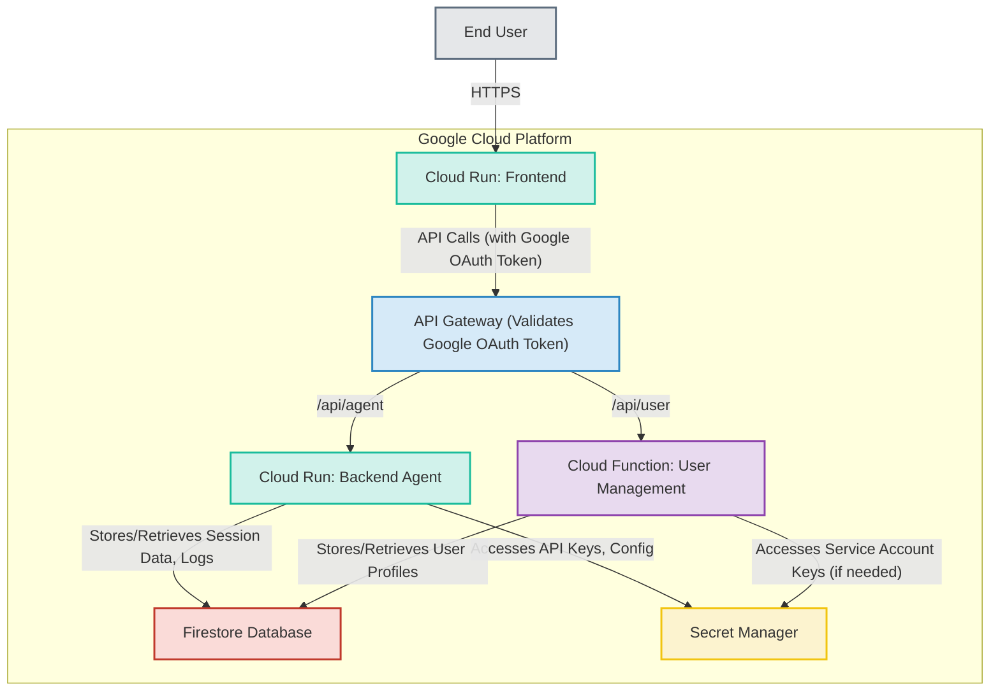

```mermaid
graph TD
    subgraph "Google Cloud Platform"
        API_Gateway["API Gateway (Validates Google OAuth Token)"]
        Cloud_Run_Frontend[Cloud Run: Frontend]
        Cloud_Run_Backend[Cloud Run: Backend Agent]
        Cloud_Function_UserMgmt[Cloud Function: User Management]
        Firestore[Firestore Database]
        Secret_Manager[Secret Manager]
    end

    User[End User]

    %% User Interaction Flow
    User -- HTTPS --> Cloud_Run_Frontend

    %% API Gateway Routing
    API_Gateway -- /api/agent --> Cloud_Run_Backend
    API_Gateway -- /api/user --> Cloud_Function_UserMgmt

    %% Frontend Interactions
    Cloud_Run_Frontend -- API Calls (with Google OAuth Token) --> API_Gateway

    %% Backend Agent Interactions
    Cloud_Run_Backend -- Stores/Retrieves Session Data, Logs --> Firestore
    Cloud_Run_Backend -- Accesses API Keys, Config --> Secret_Manager

    %% Cloud Function Interactions
    Cloud_Function_UserMgmt -- Stores/Retrieves User Profiles --> Firestore
    Cloud_Function_UserMgmt -- Accesses Service Account Keys (if needed) --> Secret_Manager

    %% Authentication/Authorization
    %% Removed direct authentication line from Frontend to User Management Function

    %% Component Styles (Optional, for better readability if rendered)
    style API_Gateway fill:#D6EAF8,stroke:#2E86C1,stroke-width:2px
    style Cloud_Run_Frontend fill:#D1F2EB,stroke:#1ABC9C,stroke-width:2px
    style Cloud_Run_Backend fill:#D1F2EB,stroke:#1ABC9C,stroke-width:2px
    style Cloud_Function_UserMgmt fill:#E8DAEF,stroke:#8E44AD,stroke-width:2px
    style Firestore fill:#FADBD8,stroke:#C0392B,stroke-width:2px
    style Secret_Manager fill:#FCF3CF,stroke:#F1C40F,stroke-width:2px
    style User fill:#E5E7E9,stroke:#5D6D7E,stroke-width:2px
```
