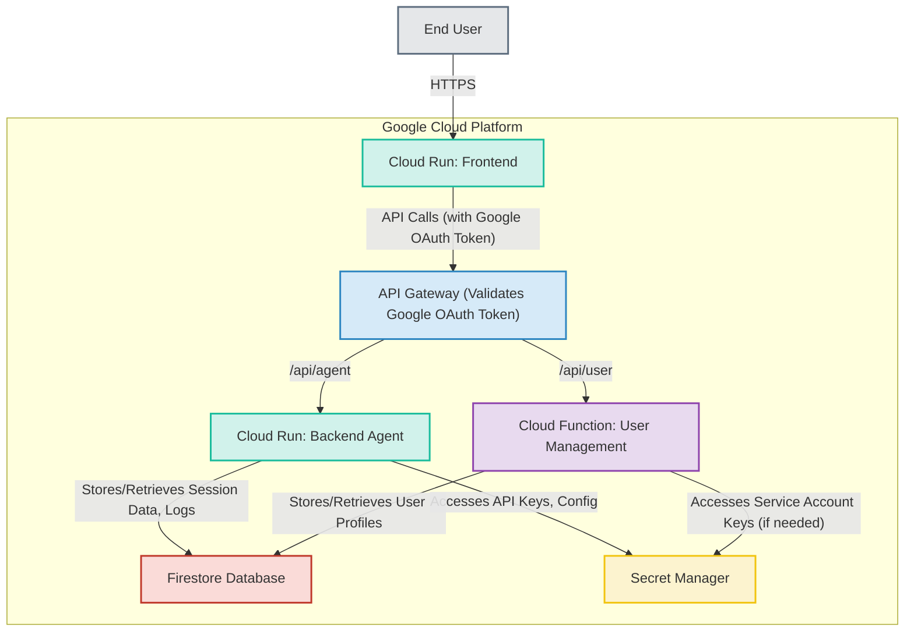
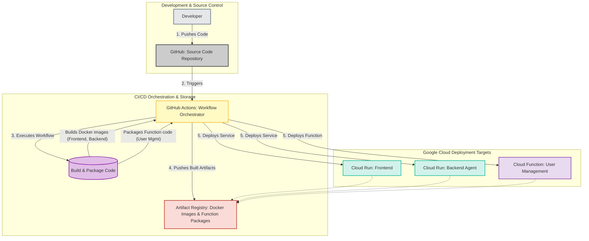

# Reomir

Your enterprise developer portal boosted by AI :rocket:

## Project Overview

Reomir is an AI-powered developer portal designed to streamline enterprise development workflows. It provides a centralized platform for developers to access tools, documentation, and resources, with AI assistance integrated to enhance productivity.

## Features
- **AI-Powered Assistance:** Integrates with AI to enhance developer productivity.
- **Centralized Developer Hub:** Provides a single platform for tools, documentation, and resources.
- **Google OAuth Integration:** Secure user authentication using Google accounts.
- **GitHub Integration:** Connect your GitHub account to manage repositories and streamline workflows. Access and manage this in User Settings.
- **Dynamic User Profile Management:** Allows users to manage their profile information.
- **Terraform Managed Infrastructure:** Ensures reproducible and scalable deployments on Google Cloud.
- **Automated CI/CD Pipeline:** Uses GitHub Actions for building and deploying services.

## Architecture

The project follows a modern web architecture:

*   **Frontend:** A Next.js application providing the user interface. User authentication is initiated here, redirecting to Google for OAuth.
*   **API Gateway:** Manages and secures access to backend services. It validates Google OAuth tokens to authenticate API requests.
*   **Backend Agent:** A Python-based agent responsible for AI logic and backend operations, accessed via the API Gateway.
*   **Cloud Functions:** Serverless functions for specific backend tasks (e.g., user profile management post-authentication), accessed via the API Gateway.
*   **Infrastructure:** Managed by Terraform, ensuring reproducible and scalable deployments on Google Cloud.

## Getting Started

To get Reomir up and running, please refer to the detailed [Installation Guide](INSTALL.md). The guide provides step-by-step instructions for setting up the project, including prerequisites, OAuth configuration, and Terraform deployment.

### Environment Variable Overview
Key backend services, particularly the Cloud Functions, rely on environment variables set during deployment (typically via Terraform). These include:
*   `GOOGLE_CLIENT_ID`, `GOOGLE_CLIENT_SECRET`: For Google OAuth.
*   `NEXTAUTH_SECRET`, `NEXTAUTH_URL`: For Next.js authentication.
*   `GITHUB_CLIENT_ID`, `GITHUB_CLIENT_SECRET`: For the GitHub integration feature.
*   `FRONTEND_URL`: Base URL of the deployed frontend, used by backend services for redirects.
*   `API_GATEWAY_BASE_URL`: Base URL of the deployed API Gateway, used by backend services to construct callback URLs.

Detailed setup for these, especially OAuth credentials, can be found in the [Installation Guide](INSTALL.md).

## Google Hackathon Context

This project was developed as part of the Google Hackathon Agentic AI Challenge. While it demonstrates innovative AI integration, it is a prototype and not yet production-ready.

## Cost Optimization Note

To minimize operational costs during development and demonstration, the cloud instances are configured to stop when not actively in use. In a production environment, these instances would typically have higher memory allocations and would be configured to run continuously to ensure availability.

## CI/CD Pipeline
The project uses GitHub Actions for CI/CD. When changes are pushed to the main branch, GitHub Actions workflows are triggered to:
- Build Docker images for the frontend and backend agent services.
- Package the Cloud Function code.
- Push the Docker images to Google Artifact Registry.
- Deploy the new versions of the Cloud Run services (frontend and backend) and the Cloud Function.
This automated process ensures that new changes are quickly and reliably deployed to the Google Cloud environment.
The diagram below illustrates this pipeline:

## General disclaimer

Some of the parts of this project have been created using AI tools reviewed by the development team.

These generated parts helped fitting the agenda for the Hackaton, and allowed the team to provide a better product.