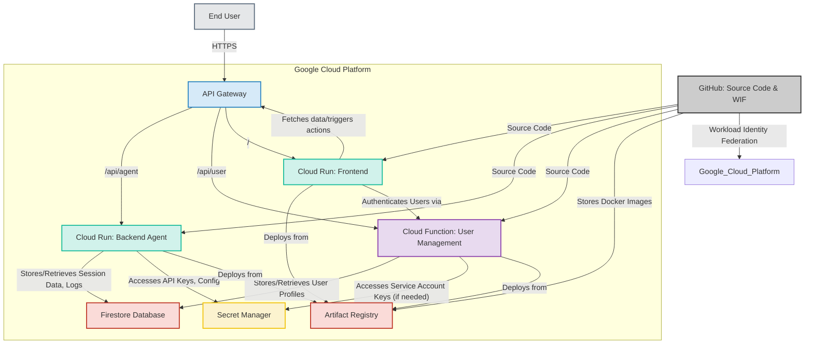

# Reomir

Your enterprise developer portal boosted by AI :rocket:

## Project Overview

Reomir is an AI-powered developer portal designed to streamline enterprise development workflows. It provides a centralized platform for developers to access tools, documentation, and resources, with AI assistance integrated to enhance productivity.

## Architecture

The project follows a modern web architecture:

*   **Frontend:** A Next.js application providing the user interface.
*   **Backend Agent:** A Python-based agent responsible for AI logic and backend operations.
*   **Cloud Functions:** Serverless functions for specific backend tasks.
*   **Infrastructure:** Managed by Terraform, ensuring reproducible and scalable deployments on Google Cloud.

## Getting Started

To get Reomir up and running, please refer to the detailed [Installation Guide](INSTALL.md). The guide provides step-by-step instructions for setting up the project, including prerequisites, OAuth configuration, and Terraform deployment.

## Google Hackathon Context

This project was developed as part of the Google Hackathon Agentic AI Challenge. While it demonstrates innovative AI integration, it is a prototype and not yet production-ready.

## Cost Optimization Note

To minimize operational costs during development and demonstration, the cloud instances are configured to stop when not actively in use. In a production environment, these instances would typically have higher memory allocations and would be configured to run continuously to ensure availability.

## General disclaimer

Some of the parts of this project have been created using AI tools reviewed by the development team.

These generated parts helped fitting the agenda for the Hackaton, and allowed the team to provide a better product.